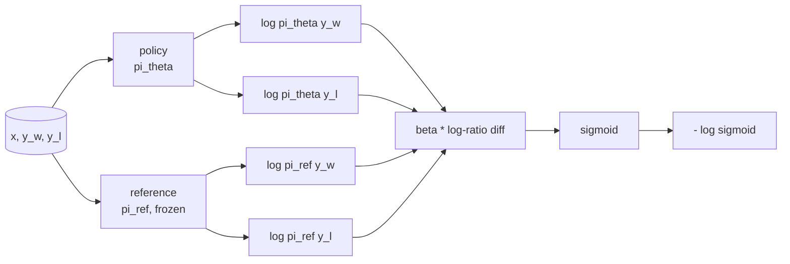
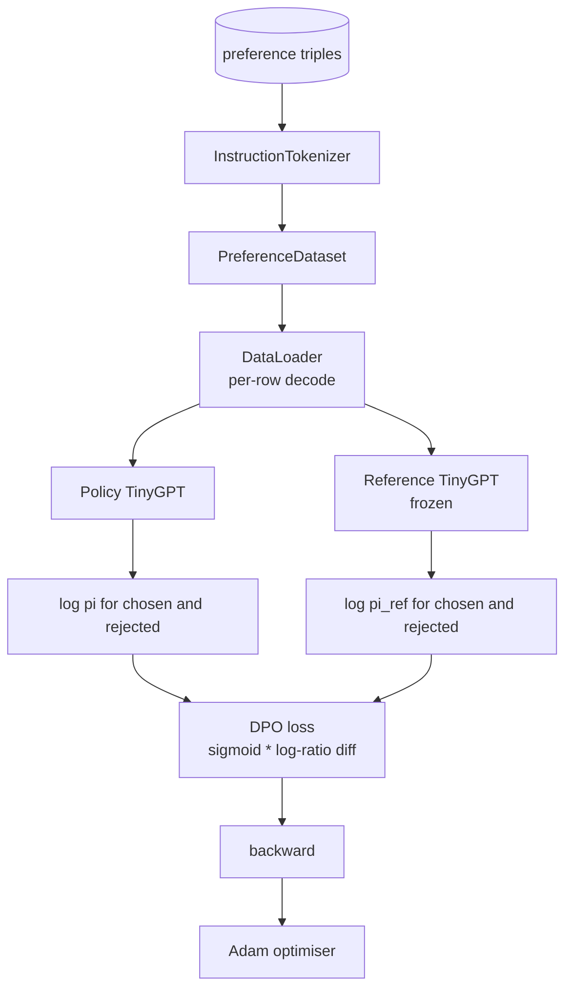

# Capstone Lesson 40: Direct Preference Optimization from Scratch

> Reward models and PPO are the classical RLHF stack. DPO collapses that stack into a single supervised loss that fits a policy directly against preference pairs. This lesson derives the DPO loss from the reward-difference identity, ships a working reference model plus policy model, computes per-token log-probabilities, and trains a tiny transformer on a preference fixture of chosen and rejected completions. Tests pin the loss math and the gradient direction so you know the implementation matches the paper.

**Type:** Build
**Languages:** Python (torch, numpy)
**Prerequisites:** Phase 19 lessons 30-37 (NLP LLM track: tokenizer, embedding table, attention block, transformer body, pre-training loop, checkpointing, generation, perplexity)
**Time:** ~90 minutes

## Learning Objectives

- Derive the DPO loss as a sigmoid over a scaled log-ratio difference and connect it to the implicit reward.
- Build a reference model + policy model pair with a frozen reference and a trainable policy.
- Compute sequence-level log-probabilities under both models, masking prompt tokens.
- Train the policy on `(prompt, chosen, rejected)` triples and watch the chosen log-prob rise relative to rejected.
- Pin behaviour with tests on the loss math, the gradient sign, and the reference invariance.

## The Problem

You have an SFT model. It follows instructions, but its outputs are uneven; some completions are clear, some are wordy or wrong. You also have a small dataset of preference pairs: for the same prompt, a human marked one completion as chosen and the other as rejected.

The classical RLHF answer is a two-stage pipeline. Train a reward model on the preferences. Optimise the policy against the reward with PPO. This works but is expensive: two models in memory during PPO, KL control to keep the policy near the reference, reward hacking when the reward model is brittle.

DPO replaces both stages with a single supervised loss. The reward model never exists explicitly. The policy is trained directly on the preference pairs, with an explicit KL penalty toward the SFT reference. Same optimal solution under the Bradley-Terry preference model, far less code.

## The Concept

Start from the Bradley-Terry model. Given a prompt `x` and two completions `y_w` (chosen) and `y_l` (rejected), the probability the human prefers `y_w` is

```text
P(y_w > y_l | x) = sigmoid( r(x, y_w) - r(x, y_l) )
```

where `r` is some latent reward function. RLHF first fits `r` from preferences, then trains a policy `pi` to maximise `r` with a KL anchor:

```text
max_pi   E_{x, y~pi} [ r(x, y) ] - beta * KL(pi || pi_ref)
```

The DPO derivation observes that the optimal policy `pi*` under this objective has a closed form in terms of `r`:

```text
pi*(y | x) = (1/Z(x)) * pi_ref(y | x) * exp( r(x, y) / beta )
```

Re-arrange for `r`:

```text
r(x, y) = beta * ( log pi*(y | x) - log pi_ref(y | x) ) + beta * log Z(x)
```

The `log Z(x)` term is the same for both `y_w` and `y_l` (it depends on `x`, not `y`), so it cancels when you compute the preference difference:

```text
r(x, y_w) - r(x, y_l) = beta * ( log pi_theta(y_w|x) - log pi_ref(y_w|x)
                                - log pi_theta(y_l|x) + log pi_ref(y_l|x) )
```

Substitute into the Bradley-Terry sigmoid and take negative log likelihood over preference pairs:

```text
L_DPO(theta) = - E_{(x, y_w, y_l)} [
  log sigmoid( beta * ( log pi_theta(y_w|x) - log pi_ref(y_w|x)
                       - log pi_theta(y_l|x) + log pi_ref(y_l|x) ) )
]
```

This is the loss. It is a sigmoid over a single scalar per example, computed from four log-probabilities. No separate reward model. No PPO. No KL term in the loss; the KL constraint is baked into the closed-form derivation.



## The Sign of the Gradient

A useful sanity check before any training run. Take the gradient with respect to `log pi_theta(y_w | x)`:

```text
d L_DPO / d log pi_theta(y_w | x) = - beta * (1 - sigmoid(z))
```

where `z` is the argument to the sigmoid. This is negative for all `z`, which means: increasing the policy's log-probability of the chosen completion decreases the loss. Symmetrically, the gradient with respect to `log pi_theta(y_l | x)` is positive: increasing the rejected log-probability increases the loss. Training pushes the chosen up and the rejected down. The reference is frozen; it does not move.

## The Data

Twelve preference triples ship with the lesson. Each is `(prompt, chosen, rejected)`. The chosen completion is short and precise. The rejected is wordy, off-topic, or wrong. The pairs cover the same task families as lesson 39 (capital, arithmetic, list) so a policy that started from an SFT base has a reasonable starting point.

The fixture is intentionally small. DPO works on tens of thousands of pairs in production; here, the point is that the loss math and the loop run end-to-end on a tiny dataset and the chosen-versus-rejected log-prob gap visibly grows.

## Reference Invariance

A DPO implementation has to handle the reference model carefully. The reference is the SFT model frozen in place. Three properties have to hold:

- The reference parameters never receive gradients.
- The reference log-probabilities never change between epochs.
- The policy starts from the same weights as the reference. (The optimal `theta` is the reference plus a learned update; initialising the policy as a copy of the reference is the well-defined start.)

The implementation enforces these by:

- Wrapping the reference in `torch.no_grad()` during forward passes.
- Setting `requires_grad=False` on every reference parameter.
- Constructing the policy via `policy.load_state_dict(reference.state_dict())` after the reference is built.

## Architecture



The model is the same TinyGPT used in lesson 39 (decoder-only, causal, byte tokeniser). The reference and policy share the architecture; the policy's weights drift from the reference under training while the reference stays fixed.

## What you will build

The implementation is one `main.py` plus tests.

1. `InstructionTokenizer`: byte tokeniser with `INST` and `RESP` specials. Same shape as lesson 39.
2. `TinyGPT`: decoder-only transformer. Same shape as lesson 39 so the lesson is self-contained even if you skipped 39.
3. `make_preferences`: returns twelve `(prompt, chosen, rejected)` triples.
4. `sequence_log_prob`: given the model, a prompt prefix, and a completion, returns the sum of next-token log-probabilities over the completion (no prompt-position contribution).
5. `dpo_loss`: takes the four log-probabilities and `beta`, returns the per-example loss tensor and the implicit reward delta for logging.
6. `train_dpo`: per-epoch loop that computes chosen and rejected log-probs under policy and reference, applies the loss, and steps Adam.
7. `evaluate_margins`: returns the mean chosen-rejected log-probability margin under the policy at any point.
8. `run_demo`: builds reference and policy from a small warm-up pretrain, copies weights, trains for thirty steps, prints the per-step loss and margin, and exits zero on success.

## Why DPO works

DPO is mathematically equivalent to RLHF under the Bradley-Terry preference model, up to the parameterisation of the reward. The implicit reward `r(x, y) = beta * (log pi(y|x) - log pi_ref(y|x))` is identifiable from preferences up to a function of `x`, which cancels in the difference. The closed-form policy lets you skip the explicit reward model. The KL constraint is enforced structurally: any deviation of `pi` from `pi_ref` makes the log-ratio larger, and the sigmoid saturates, which damps the gradient when the policy moves too far. The reference is your safety net.

## Stretch goals

- Add a length normalisation to the log-probability sum: divide by completion length. Length bias is a known DPO failure mode where the model preferentially chooses shorter completions because their log-probabilities are larger in absolute terms.
- Add the IPO variant of the loss: replace the sigmoid + log with `(z - 1)^2`. Compare convergence on the fixture.
- Add a label-smoothing parameter that interpolates between the hard chosen-rejected label and a uniform 0.5.
- Replace the reference with a smaller cheaper model (knowledge distillation flavour).

The implementation gives you the loss, the reference invariance, and the training loop. The math is the lesson. The code makes the math concrete.
